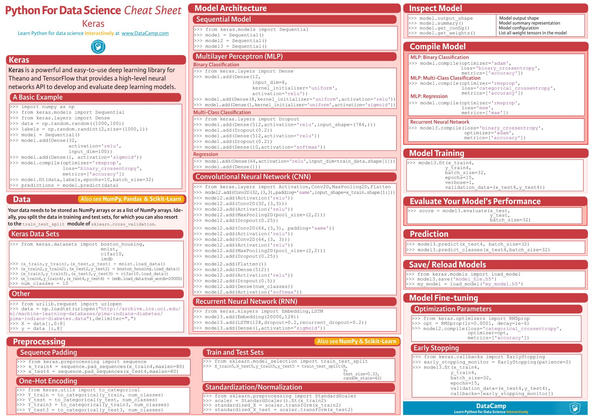

# Deep Learning Tutorials

# Cheet Sheets

https://ja.scribd.com/document/352434799/Keras-Cheat-Sheet-Python

https://becominghuman.ai/cheat-sheets-for-ai-neural-networks-machine-learning-deep-learning-big-data-678c51b4b463

# ToDO
- [ ] NN
- [ ] CNN
- [ ] RNN(LSTM)
- [ ] Auto Encoder
- [ ] Sparse Encoder
- [ ] Variational Encoder
- [ ] Bolzman Machine
- [ ] Restricted Bolzman Machine
- [ ] Generative Adversarial Network
- [ ] Deep Residual Network

# References
https://becominghuman.ai/cheat-sheets-for-ai-neural-networks-machine-learning-deep-learning-big-data-678c51b4b463
http://www.procrasist.com/entry/11-ml-cheat-sheet