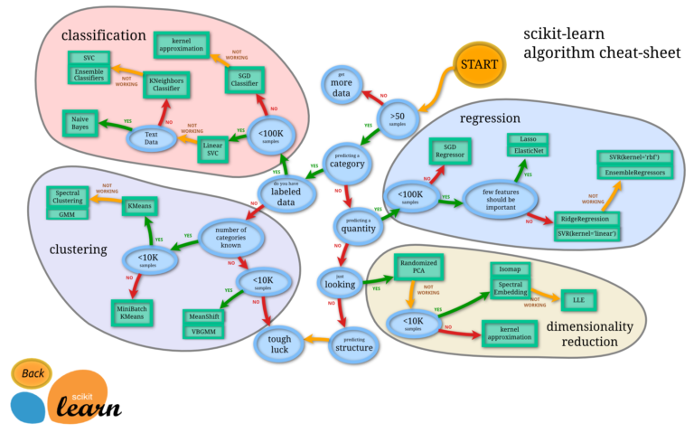
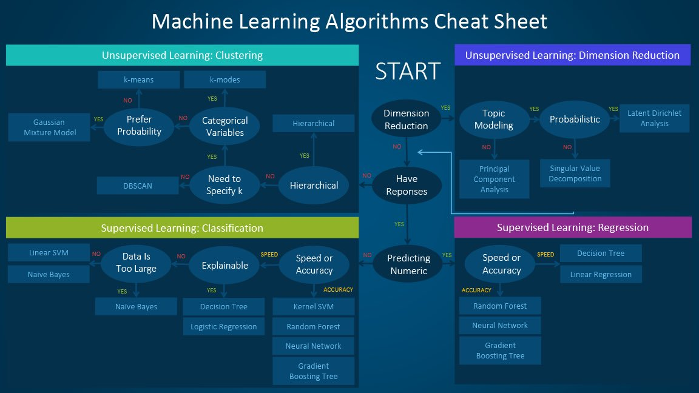
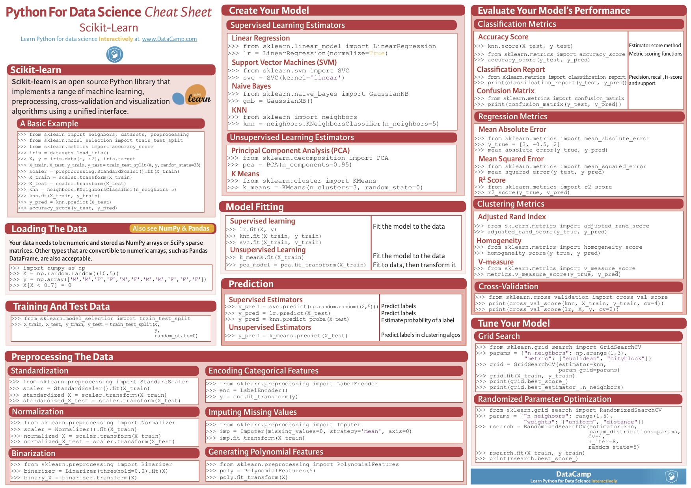

# Machine Learning Tutorials

# Cheet Sheets

https://becominghuman.ai/cheat-sheets-for-ai-neural-networks-machine-learning-deep-learning-big-data-678c51b4b463

https://www.slideshare.net/sean22/machine-learning-cheat-sheet

https://www.datacamp.com/community/blog/scikit-learn-cheat-sheet  

# ToDO
### Regression 
- [x] SGD
- [x] Lasso
- [x] Ridge
- [x] Elastic Net  
- [x] SVR linear

- [ ] SVR kernel
- [ ] Ensemble

### Classification
- [x] SGD Classifer
- [x] Linear SVM
- [x] kernel approximation
- [x] Kernel SVM
- [x] k-Neighbors

- [x] Decision Tree
- [x] Random Forest
- [x] Gradient Boosting Tree

- [ ] Naive Bayes

### Clustering
- [ ] k-means
- [ ] k-modes
- [ ] Gausian Mixture model
- [ ] DBSCAN

- [ ] Mean Shift VBGMM
- [ ] MiniBatch k-means
- [ ] Spectral Clustering GMM

### Dimension Reduction
- [ ] Randomized PCA 

- [ ] Isomap Spectral Embeding
- [ ] kernel approximation
- [ ] LLE

### その他
- [ ] cross validation
- [ ] ハイパーパラメータ調整(グリッドサーチ、hyperas)

# References
https://qiita.com/ishizakiiii/items/0650723cc2b4eef2c1cf
https://qiita.com/sugulu/items/e3fc39f2e552f2355209